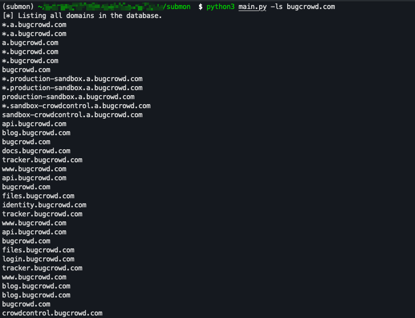

```console
  subdomain - Python script to monitor subs from crt.sh
  _________    ___.       _____   ________    _______   
 /   _____/__ _\_ |__    /     \  \_____  \   \      \  
 \_____  \|  |  \ __ \  /  \ /  \  /   |   \  /   |   \ 
 /        \  |  / \_\ \/    Y    \/    |    \/    |    \
/_______  /____/|___  /\____|__  /\_______  /\____|__  /
        \/          \/         \/         \/         \/ 
```

#### Features

- List subdomains from a domain from sqlite database (-ls)
- List domains inside sqlite (-l)
- Delete a domain and subdomains from database
- Monitor single domain
- Filter wildcard subdomains
- Run nuclei (🫠)
- Send information to TELEGRAM (ONLY!)

#### Configura/install

1. Configure the *.env* file, inside ROOT folder of the project
2. Set your telegram tokens inside this *.env*. Example:

```console
API_TOKEN_TELEGRAM=411XXXXXX:XXXXXXXX
CHAT_ID=12345678909
```
3. More info how to create/setup Telegram. [https://www.shellhacks.com/telegram-api-send-message-personal-notification-bot/](https://www.shellhacks.com/telegram-api-send-message-personal-notification-bot/)
4. Install requirements 

- 1. method using python
```bash
$ python3 -m pip install requirements.txt --user
```
- 2. method using pipenv
```bash
$ pipenv shell
$ pipenv install -r requirements.txt
```

#### Usage

```console
usage: main.py [-h] [-f FILE] [-d DELETE] [-l] [-ls LISTSUB] [-sd SINGLEDOMAIN] [-n]

Submon - A tool to find subdomains and certificates and monitor them for changes.

options:
  -h, --help            show this help message and exit
  -f FILE, --file FILE  file with domains to monitor
  -d DELETE, --delete DELETE
                        delete a domain and its subdomains from the database
  -l, --list            list all domains in the database
  -ls LISTSUB, --listsub LISTSUB
                        list all subdomains for a domain
  -sd SINGLEDOMAIN, --singledomain SINGLEDOMAIN
                        check a single domain
  -n, --nuclei          run nuclei on the new subdomains
```

1. Run using a file

- inside domains file insert the domains, you want to monitor (ex: foo.com)
```
python3 main.py -f domains.txt
```

2. List subdomains from a domain
```bash
$ python3 main.py -ls foo.com
```

3. List domains
```bash
python3 main.py -l
```

#### Poc





##### How to MONITOR!


- If you're deploying on a Unix-like system, you can use cron jobs to schedule your script to run at specific intervals.

```bash
chmod +x main.py
```

- Open crontab editor

```
crontab -e
```

- Add a new cron job to run your script every 24 hours. Assuming main.py is at /path/to/main.py:
```
0 0 * * * /usr/bin/python3 /path/to/main.py
```
- This will run the script every day at midnight. Adjust the paths as necessary.

#### Others ways to (while true)

- Using `watch` command
- Using a custom `bash` script
- tmux.. and others..

#### Why use this tool :P

The script focuses on monitoring for new subdomains of a given domain using the `crt.sh` public API, which can be a component of bug bounty hunting. Monitoring for subdomain creation can be valuable in bug bounty programs for a number of reasons:

1. **New Attack Surface**: New subdomains can lead to new applications, servers, and services that may not have gone through as rigorous security reviews as older, more established ones. This can provide opportunities for vulnerabilities.
 
2. **Forgotten Debug/Dev Versions**: Sometimes developers might put up a temporary subdomain for debugging or testing without realizing it's exposed to the public. These might be less secure or contain more verbose error messages that can help in exploiting other vulnerabilities.

3. **Information Gathering**: Even if a subdomain isn't vulnerable, it can provide information about a company's infrastructure, technologies they're using, naming conventions, and more.
